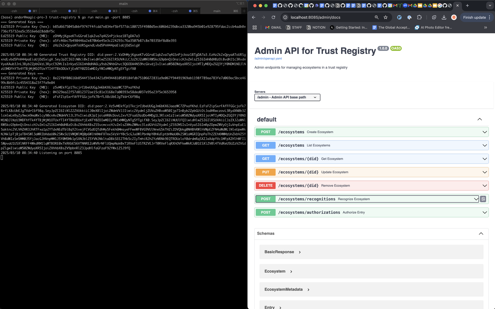
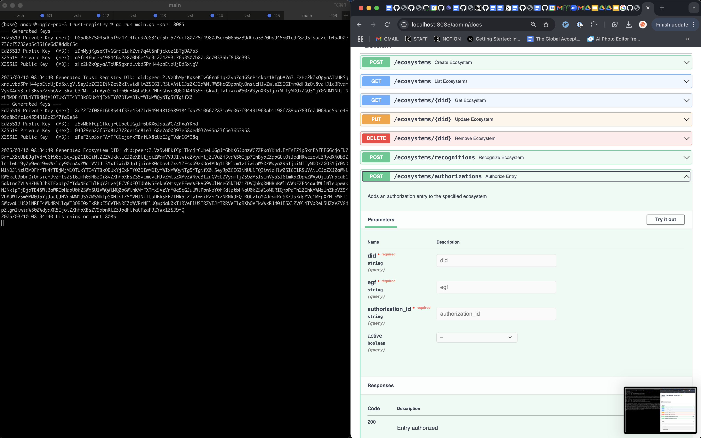
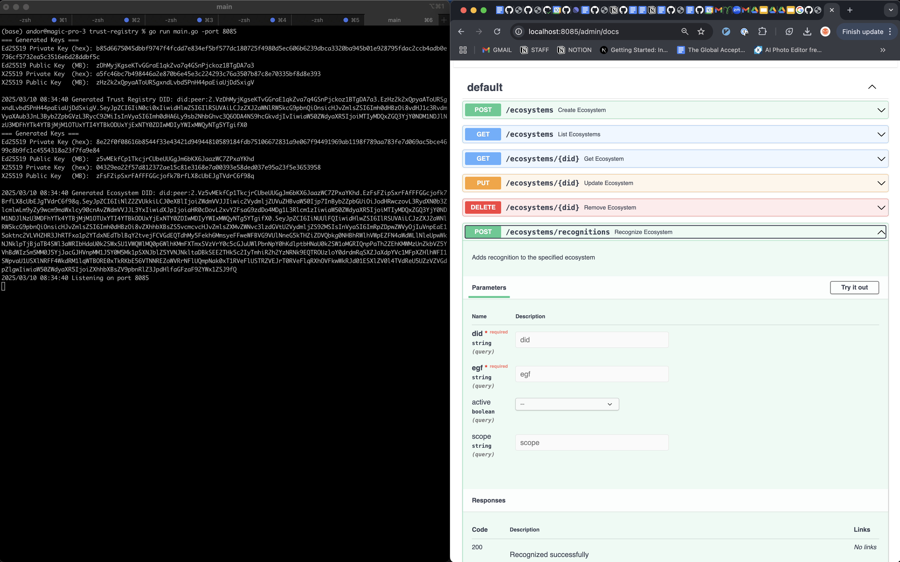
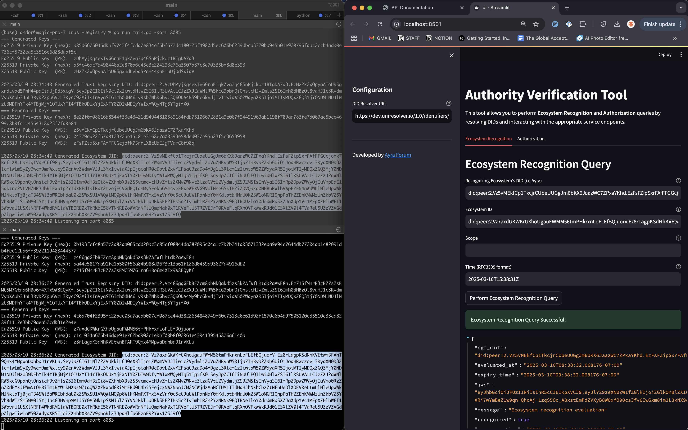

# Ayra Trust Network Playground

This document provides instructions for setting up and testing your own Ayra Trust Network playground environment.

::: note
This is a DRAFT
::: 

## Prerequisites

- Go programming language (version 1.15+)
- Python (version 3.7+) with pip installed

## Initial Setup

1. Clone the repository:
   ```
   git clone https://github.com/ayra-network/trust-playground.git
   cd playground 
   ```

## Step 1: Set up a Sample Ayra Trust Registry

1. Navigate to the `trust-registry` directory:
   ```
   cd trust-registry
   ```

2. Initialize the Go modules:
   ```
   go mod tidy
   ```

3. Run the Go program:
   ```
   go run main.go -port 8085
   ```

4. You will see a DID generated in the console output. Take note of this as it will be referred to as the **Ayra DID**.

## Step 2: Set up a Sample Ecosystem

1. Open a new terminal window

2. Navigate to the `trust-registry` directory:
   ```
   cd trust-playground/trust-registry
   ```

3. Run the Go program on a different port:
   ```
   go run main.go -port 8083
   ```

4. This creates a second ecosystem running independently of the Ayra Trust Registry.

5. Note the DID generated for this ecosystem, which will be referred to as the **Sample Ecosystem DID**.



## Step 3: Authorize an Entry in Your Ecosystem

1. Open a web browser and navigate to `http://localhost:8083/admin/docs`
2. Locate and select the `admin/authorize` API endpoint
3. Enter the following required parameters:
   - Authorization Type: [string that defines the type of authorization]
   - EGF Identifier: [identifier for your ecosystem governance framework]
   - Entry ID: [unique identifier for the entity being authorized]
4. Submit the request
5. The entity is now authorized within your sample ecosystem

*Note: In production environments, authorization will follow your specific trust framework and governance processes. This is a simplified sample implementation.*



## Step 4: Establish Recognition Between Ecosystems

1. Navigate to `http://localhost:8085/admin/docs` in your browser
2. Locate and select the `/admin/recognition` API endpoint
3. Enter the following parameters:
   - Target Ecosystem: [Sample Ecosystem DID from Step 2]
   - EGF DID: [Ayra Ecosystem DID from Step 1]
4. Submit the request



*Note: In production, this recognition process will be conducted through the formal Ayra Governance Process.*

## Step 5: Test Verification

This step allows you to test both recognition and authorization aspects of the Ayra Trust Network through a verification interface.

1. Navigate to the verifier directory:
   ```
   cd trust-playground/verifier
   ```
2. Install the required Python dependencies:
   ```
   python -m pip install -r requirements.txt
   ```
3. Launch the Streamlit verification interface:
   ```
   python -m streamlit run ui.py
   This will open a web interface in your default browser.

### Step 5.1: Test Ecosystem Recognition

1. In the Streamlit interface, navigate to the "Recognition Test" tab
2. Complete the form with the following information:
   - EGF DID: [Enter the Ayra DID from Step 1]
   - Target DID: [Enter the Sample Ecosystem DID from Step 2]
3. Click the "Run Query" button
4. The interface will display the recognition status and details of the trust relationship between the two ecosystems

This query demonstrates the *recognition* mechanism of the Ayra Trust Network, confirming whether one ecosystem recognizes another.




### Step 5.2: Test Ecosystem Authorization

1. Navigate to the "Authorization Test" tab in the Streamlit interface

2. Complete the form with the following information:
   - EGF: [Enter the Sample Ecosystem DID from Step 2]
   - Entity ID: [Enter the authorized entity ID from Step 3]
   - Authorization Type ID: [Enter the authorization type string from Step 3]
3. Click the "Run Query" button
4. The interface will display the authorization status, confirming whether the specified entity is authorized within the ecosystem

This query demonstrates the *authorization* mechanism of the Ayra Trust Network, verifying the credentials of entities within an ecosystem.


## Exploring DIDs

To better understand the structure of the DIDs created:

1. Visit https://dev.uniresolver.io
2. Enter any of the DIDs generated during this setup
3. Review the DID document structure and properties

## Security Notice

The JWT signatures in response messages should be verified to ensure message
integrity. The current implementation in this playground environment does not
include comprehensive signature verification for demonstration purposes.

## Troubleshooting

- If services fail to start, ensure the specified ports are not already in use
- Verify that all DIDs are copied correctly when used in API calls
- Check console output for any error messages that might identify configuration issues

## Next Steps

After successful testing in the playground environment, review the Ayra Trust
Network documentation for production implementation guidelines and best
practices.
